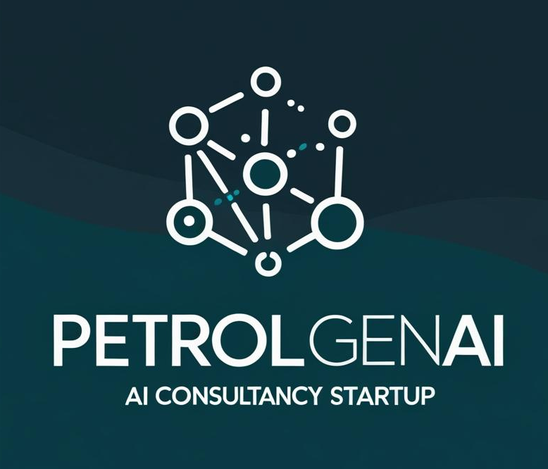
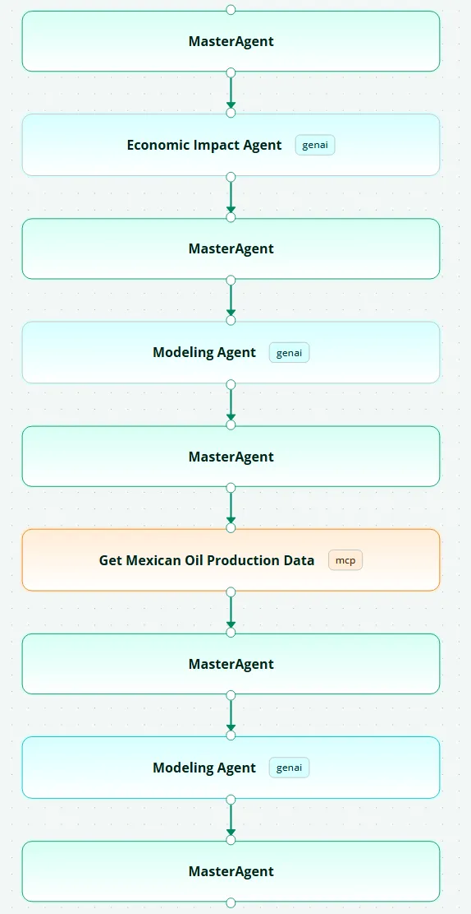

# 🛢️ Mexican Oil Production Forecasting - Multi-Agent AI System

<!-- Add your project logo here -->
<p align="center">
  
</p>

## 🎯 **Project Purpose**

This project demonstrates a cutting-edge **Multi-Agent AI System** for predictive modeling of Mexican oil production Call PetrolGenAi (Please refer to the notion Pitch deck for startup proposal) with comprehensive economic impact analysis. The system leverages advanced AI agents, MCP (Model Context Protocol) integration, and real-time data processing to provide accurate forecasts and economic insights for the Mexican oil industry.

### **Key Objectives:**
- **Predictive Modeling**: Forecast oil production for major Mexican oil fields
- **Economic Impact Analysis**: Calculate fiscal and economic implications
- **Real-time Data Integration**: Access live data from Cloudera Data Platform
- **Intelligent Orchestration**: Coordinate multiple AI agents for comprehensive analysis
- **Decision Support**: Provide actionable insights for oil industry stakeholders

---

## 🏗️ **How It Works**

### **System Architecture Overview**

```
User Query → Master Agent →  Economic Analysis  → AI Modeling → MCP Data Collection →  AI Modeling → Comprehensive Report
```

<!-- Add your architecture diagram here -->
<p align="center">
  
  <br><em>AgentFlow</em>
</p>

### **Multi-Agent Workflow**

1. **User Input**: Submit natural language queries via intuitive web interface
2. **Intent Detection**: Master Agent automatically detects oil forecasting requests
3. **Data Collection**: Cloudera MCP Server accesses PRODUCCION_CAMPOS_Jan-25.csv
4. **AI Modeling**: Advanced forecasting models generate production predictions
5. **Economic Analysis**: Comprehensive fiscal and economic impact assessment
6. **Result Compilation**: Integrated report with forecasts, analysis, and recommendations

### **Agent Roles & Responsibilities**

| Agent | Technology | Purpose | Key Functions |
|-------|------------|---------|---------------|
| **Master Agent** | ReAct + LangGraph | Orchestration | Intent detection, workflow management, result compilation |
| **Cloudera MCP** | MCP Protocol | Data Collection | Access oil production data, field statistics, economic indicators |
| **AI Modeling** | GenAI Agent | Forecasting | Time series analysis, ML models, statistical forecasting |
| **Economic Impact** | GenAI Agent | Economic Analysis | Fiscal impact, GDP effects, employment analysis |

### **Data Flow Visualization**

```
┌─────────────────┐    ┌─────────────────┐    ┌─────────────────┐    ┌─────────────────┐
│   Frontend UI   │    │   Backend API   │    │   Router        │    │  Master Agent   │
│                 │    │                 │    │                 │    │                 │
│ User Query:     │───▶│ Forward Query   │───▶│ WebSocket       │───▶│ Parse Intent &  │
│ "Forecast oil   │    │ to Router       │    │ Connection      │    │ Orchestrate     │
│ production for  │    │                 │    │                 │    │                 │
│ Ku-Maloob-Zaap" │    │                 │    │                 │    │                 │
└─────────────────┘    └─────────────────┘    └─────────────────┘    └─────────────────┘
                                                                              │
                                                                              ▼
┌─────────────────┐    ┌─────────────────┐    ┌─────────────────┐    ┌─────────────────┐
│  Cloudera MCP   │    │  AI Modeling    │    │  Economic       │    │  Master Agent   │
│    Server       │    │    Agent        │    │   Agent         │    │                 │
│                 │    │                 │    │                 │    │                 │
│ ◀─── MCP Tools  │    │ ◀─── Data       │    │ ◀─── Forecast   │    │ ──── Compile    │
│     Call        │    │     & Process   │    │     & Analyze   │    │     Results     │
│                 │    │                 │    │                 │    │                 │
│ ──── Return     │    │ ──── Return     │    │ ──── Return     │    │ ──── Send       │
│     Data        │    │     Forecast    │    │     Economic    │    │     Report      │
│                 │    │                 │    │     Analysis    │    │                 │
└─────────────────┘    └─────────────────┘    └─────────────────┘    └─────────────────┘
         │                       │                       │                       │
         ▼                       ▼                       ▼                       ▼
┌─────────────────┐    ┌─────────────────┐    ┌─────────────────┐    ┌─────────────────┐
│  Impala DB      │    │  Time Series    │    │  Fiscal Impact  │    │  Router         │
│                 │    │  Models         │    │  Analysis       │    │                 │
│ PRODUCCION_     │    │  ML Algorithms  │    │  GDP Effects    │    │ ──── Forward    │
│ CAMPOS_Jan-25   │    │  Statistical    │    │  Employment     │    │     Results     │
│ .csv            │    │  Analysis       │    │  Analysis       │    │                 │
└─────────────────┘    └─────────────────┘    └─────────────────┘    └─────────────────┘
```


---

## 🚀 **Implementation & Setup Guide**

### **Prerequisites**

- [Docker](https://www.docker.com/) & [Docker Compose](https://docs.docker.com/compose/)
- [Python 3.10+](https://www.python.org/downloads/)
- [UV Package Manager](https://docs.astral.sh/uv/) (recommended) or pip
- [Git](https://git-scm.com/)

### **Step 1: Clone and Setup**

```bash
# Clone the repository
git clone https://github.com/genai-works-org/genai-agentos_LataMLOpS.git
cd genai-agentos_LataMLOpS/

# Create environment file
cp .env-example .env
```

### **Step 2: Start Core Infrastructure**

```bash
# Start Docker containers
docker compose up -d

# Verify services are running
docker compose ps
```

**Expected Services:**
- Frontend: http://localhost:3000
- Backend API: http://localhost:8000
- Router: ws://localhost:8081
- PostgreSQL: localhost:5432
- Redis: localhost:6379

### **Step 3: Setup Cloudera MCP Server**

```bash
# Navigate to MCP directory
cd cloudera-mcp/

# Install dependencies
uv sync

# Create environment configuration
cp .env_example .env

# Edit .env with your Cloudera credentials (or use mock data for demo)
# IMPALA_HOST=your-coordinator-host.cloudera.site
# IMPALA_USER=your-username
# IMPALA_PASSWORD=your-password

# Start MCP server
uv run python src/cloudera_mcp/server.py
```

### **Step 4: Register Agents**

```bash
# Navigate to CLI directory
cd ../cli/

# Install CLI dependencies
uv sync

# Register user
python cli.py signup -u admin

# Login and get JWT token
python cli.py login -u admin -p your-password

# Register AI Modeling Agent
python cli.py register_agent --name "mexican_oil_modeling_agent" --description "AI agent for Mexican oil production forecasting and modeling"

# Register Economic Impact Agent
python cli.py register_agent --name "mexican_oil_economic_agent" --description "Economic impact analysis agent for Mexican oil production"
```

### **Step 5: Start Registered Agents**

```bash
# Start Modeling Agent
cd agents/modeling_agent/
uv run python main.py

# In new terminal, start Economic Agent
cd agents/economic_impact_agent/
uv run python main.py
```

### **Step 6: Add MCP Server to UI**

1. Open http://localhost:3000 in your browser
2. Login with your credentials
3. Go to MCP Servers section
4. Add MCP Server URL: `http://localhost:8888`
5. Verify tools are available

### **Step 7: Create Agent Flow**

1. In the UI, navigate to Agent Flows
2. Create new flow with objective: "Mexican Oil Production Forecasting"
3. Add sequence: MCP Server → Modeling Agent → Economic Agent
4. Save and activate the flow

### **Step 8: Test the System**

1. Go to Chat interface in the UI
2. Submit query: "Forecast oil production for Ku-Maloob-Zaap field for next 2 years"
3. Watch the multi-agent orchestration in action
4. Review comprehensive results

---

## 📊 **Key Features**

### **Advanced AI Capabilities**
- **Multi-Model Forecasting**: Time series, ML, and econometric models
- **Real-time Data Processing**: Live access to production data
- **Intelligent Orchestration**: Automated workflow management
- **Economic Impact Analysis**: Comprehensive fiscal and economic assessment

### **Technical Innovation**
- **MCP Integration**: Standardized data access via Model Context Protocol
- **WebSocket Communication**: Real-time agent coordination
- **Docker Containerization**: Scalable, portable deployment
- **Modular Architecture**: Independent agent development and scaling

### **User Experience**
- **Natural Language Interface**: Intuitive query processing
- **Real-time Results**: Live progress tracking
- **Comprehensive Reports**: Integrated analysis and recommendations
- **Interactive Dashboard**: Visual data exploration

---

## 🏆 **Hackathon Highlights - Key Technologies & Tools**

### **🚀 Extra Points Technologies**

This project leverages cutting-edge technologies and tools that demonstrate advanced technical capabilities:

#### **📋 Notion Integration**
- **Pitch Deck**: Complete project documentation and presentation built in Notion
- **Real-time Collaboration**: Team coordination and project management
- **Professional Presentation**: Structured documentation for judges and stakeholders

#### **☁️ Cloudera MCP (Model Context Protocol)**
- **Data Integration**: Seamless access to Cloudera Data Platform
- **Real-time Data Processing**: Live connection to PRODUCCION_CAMPOS_Jan-25.csv
- **Standardized Protocol**: Industry-standard MCP implementation
- **Scalable Architecture**: Enterprise-grade data access layer

#### **🤖 GenAI Protocol**
- **Multi-Agent Communication**: Standardized agent-to-agent protocols
- **Intelligent Orchestration**: Advanced workflow management
- **Scalable Agent Framework**: Modular agent development and deployment
- **Real-time Processing**: WebSocket-based communication for live interactions

### **🎯 Innovation Points**

| Technology | Innovation | Impact |
|------------|------------|---------|
| **Notion** | Professional documentation and collaboration | Enhanced project presentation |
| **Cloudera MCP** | Enterprise data integration | Real-world data access |
| **GenAI Protocol** | Multi-agent orchestration | Advanced AI system architecture |

---

## 🎥 **Demo & Documentation**

### **📋 Pitch Deck**
[Notion Pitch Deck](https://www.notion.so/PetrolGenAI-230e32279bb880ada321fdb4c1bb150b?source=copy_link) - Comprehensive project overview, technical architecture, and business impact

### **🎬 Video Demonstration**
[Video Demo/Presentation](https://youtu.be/hLHLapPhfrQ) - Live demonstration of the multi-agent system in action and Idea Presentation.


### **👥 Team Profiles LinkedIn**


#### **Team Member 1**
- **Name**: Joshua Olave
- **Role**: AI/ML Engineer & System Architect
- **LinkedIn**: [LinkedIn Profile](https://www.linkedin.com/in/joshuaolave/)
- **Expertise**: Multi-Agent Systems, MCP Protocol, AI Orchestration

#### **Team Member 2**
- **Name**: Diego Casasbuenas
- **Role**: AI/ML Engineer & Data Scientist 
- **LinkedIn**: [LinkedIn Profile](https://www.linkedin.com/in/diegocasasbuenasai/)
- **Expertise**: Time Series Forecasting, Economic Modeling, Data Engineering

---


## 🚀 **Future Enhancements**

### **Planned Features**
- **Real-time Data Streaming**: Live production data integration
- **Advanced ML Models**: Deep learning and ensemble methods
- **Mobile Application**: iOS and Android apps
- **API Marketplace**: Third-party integrations

### **Scalability Roadmap**
- **Cloud Deployment**: AWS/Azure/GCP support
- **Multi-region Support**: Global oil field coverage
- **Enterprise Features**: Advanced security and compliance
- **AI Model Marketplace**: Custom model integration

---

## 📞 **Contact**

For questions, support, or collaboration opportunities:

- **Email**: [joshuamht@outlook.com]
- **GitHub Issues**: [Project Issues](https://github.com/genai-works-org/genai-agentos/issues)

---

**Built with ❤️ for the Energy Oil Industry**
